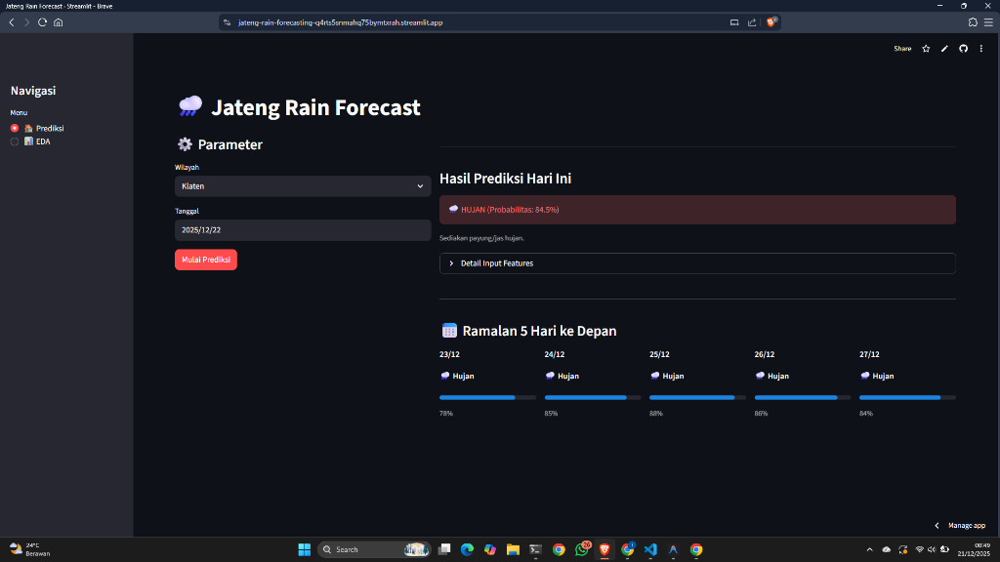
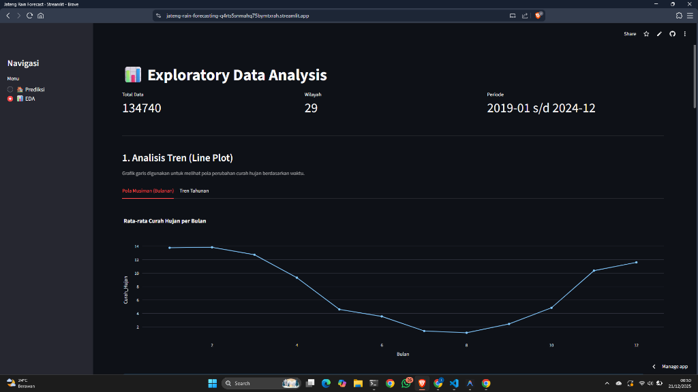

# Jateng Rain Forecasting - Prediksi Cuaca Jawa Tengah
**Tugas Besar Machine Learning 1**

Aplikasi ini dikembangkan untuk memenuhi tugas mata kuliah Machine Learning 1. Fokus utama aplikasi adalah memprediksi kondisi cuaca (Hujan/Tidak Hujan) di berbagai wilayah Kabupaten/Kota di Jawa Tengah menggunakan data historis.

## Identitas Kelompok
**Kelompok 5**
**Kelas Malam A - Angkatan 23**

### Anggota Tim:
1.  **Ahmad Muzzaki**
2.  **Anjas Pebrian**
3.  **Erik Arya**
4.  **Ifan Prima**

---

## Tentang Aplikasi

Aplikasi ini merupakan alat bantu prediksi cuaca berbasis *Machine Learning* yang dikemas dalam antarmuka interaktif menggunakan **Streamlit**.

### Fitur Utama:
1.  **Input Pengguna**: Pengguna dapat memilih tanggal dan lokasi (Kabupaten/Kota) di Jawa Tengah.
2.  **Prediksi Cuaca Harian**: Sistem akan memprediksi apakah pada tanggal dan lokasi tersebut berpotensi turun hujan atau tidak.
3.  **Prakiraan 5 Hari ke Depan**: Menampilkan tren prediksi cuaca untuk 5 hari setelah tanggal yang dipilih, membantu pengguna dalam perencanaan jangka pendek.

## Tampilan Aplikasi

### 1. Halaman Prediksi & 5-Day Forecast


### 2. Halaman Eksplorasi Data (EDA)


### Cara Kerja
Model *Machine Learning* (Random Forest) memproses input tanggal dan lokasi dengan memperhitungkan pola musiman (bulan, tanggal) serta data historis curah hujan (*lag features*) di wilayah tersebut untuk menghasilkan prediksi biner: **Hujan** atau **Tidak Hujan**.

---

## Detail Teknis

### Dataset
Data yang digunakan adalah rekapitulasi curah hujan harian dari PUSDATARU Jawa Tengah.
*   **Preprocessing**: Pembersihan *missing values* dan *resampling* untuk menangani ketidakseimbangan data.
*   **Feature Engineering**: Ekstraksi fitur waktu (`sin_bulan`, `cos_bulan`) dan fitur historis (curah hujan 1, 3, 7 hari sebelumnya).

### Model
Model yang digunakan adalah **Random Forest Classifier**, dipilih karena akurasinya yang baik dalam menangani data tabular dengan fitur kategorikal (lokasi) dan pola non-linear.

## Cara Menjalankan
1.  Pastikan dataset tersedia di folder `dataset/processed`.
2.  Jalankan aplikasi menggunakan perintah:
    ```bash
    streamlit run app_streamlit.py
    ```
